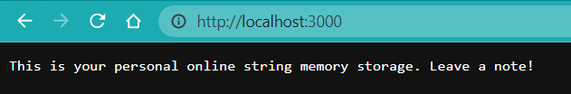

# Welcome to Localhost Server and Debugging Tutorial! 

Today's tutorial will be split into three parts: the first section walks you through the basics of creating your own server on your own computer. The second section discusses some common bugs that UCSD CSE12/15L students encounter when they're writing code. The last section is just my reflection, so read it at your own risk (jk).

## Part 1 

Here I've included the code of a server I just created called "StringServer." It uses classes from another Server.java file, whose content we will *not* be covering today. If you're interested, you can download the source code from [here](https://github.com/charliespy/wavelet). 

```java
import java.io.IOException;
import java.net.URI;
import java.util.*;

class Handler implements URLHandler {
    // The one bit of state on the server: a number that will be manipulated by
    // various requests.

    String userInput = "";

    public String handleRequest(URI url) {
        if (url.getPath().equals("/")) {
            return "This is your personal online string memory storage. Leave a note! ";
        } else {
            System.out.println("Path: " + url.getPath());
            if (url.getPath().contains("/add-message")) {
                String[] parameters = url.getQuery().split("=");
                if (parameters[0].equals("s")) {
                    userInput += parameters[1] + "\n";
                    return userInput;
                }
            } 
            return "404 Not Found!";
        }
    }
}

class StringServer {
    public static void main(String[] args) throws IOException {
        if(args.length == 0){
            System.out.println("Missing port number! Try any number between 1024 to 49151");
            return;
        }
        int port = Integer.parseInt(args[0]);
        Server.start(port, new Handler());
    }
}
```

Now, I will talk about each section of the program in detail. The server takes in a cue, `add-message?s=<string>`, and prints out all the users' previous inputs. Because of its function to store and remember things, it's sort of like a personal notepad. 

At the program's start up, it will print "This is your personal online string memory storage. Leave a note!" on the screen like this: 



This previous screenshot triggers the `handleRequest(URI url)` method in the program. This method takes in the url of the web page as its argument, and because `url.getPath()` now evaluates to nothing, as no "cue" has yet to be given, the screen shows our pre-written message only. 

Then, if the user updates the data by refreshing the page with the cue, for example by typing `/add-message?s=My name is Charlie Sun`, the page will change to this: 


We can try this a few more times with other inputs as well: 


Notice how all the previous items are printed each time the user inputs a new message? Each time the user updates the web page, the `handleRequest(URI url)` method gets triggered again, adding the user's message after the `?s` and a line breaker `\n` to the class variable `userInput`. In essence, every time the user writes something new, we update `userInput`. 


## Part 2

In this section, we will analyze a bug that I encountered in Joe's code (Oh Joe)! Here's the original program: 

```java
interface StringChecker { boolean checkString(String s); }

class ListExamples {
    // Returns a new list that has all the elements of the input list for which
    // the StringChecker returns true, and not the elements that return false, in
    // the same order they appeared in the input list;
    static List<String> filter(List<String> list, StringChecker sc) {
        List<String> result = new ArrayList<>();
        for(String s: list) {
            if(sc.checkString(s)) {
                result.add(0, s);
            }
        }
        return result;
    }
}
```

So it seems that this is a method that filters certain elements in a list of strings based on a StringChecker object. In order to test the program, I wrote some test cases, but first, we have to implement our own StringChecker class. 

```java
class MyStringChecker implements StringChecker {
    public boolean checkString(String s) {
        if (s.length() >= 3) {
            return true;
        } else {
            return false;
        }
    }
}
```

Here are one test that I wrote: 

```java
import static org.junit.Assert.*;
import org.junit.*;
import java.util.*;

public class ListTests {
    @Test
    public void testListExamples1() {
        List<String> str1 = Arrays.asList(
            new String[]{"1", "22", "333", "4444"}
        );
        StringChecker sc1 = new MyStringChecker();
        List<String> result1 = ListExamples.filter(str1, sc1);

        assertEquals(Arrays.asList(
            new String[]{"333", "4444"}
        ), result1);
    }
}
```

The expected result is a list of strings of "333" and "4444" in that order. However, when we ran the test with JUnit, we quickly found that it gave us a different result of "4444" and "333" - the order is reversed! 

Ohno! Why is that?! After closely examining Joe's code, I realized that the problem came from this line: 
```java
result.add(0, s);
```
This adds the result to the **front** of the list, instead of appending it to the back. Theoretically, this won't cause any errors, but it goes against the descriptions of the method, which states that the elements should appear "in the same order they appeared in the input list."

Luckily, this is an easy fix. All we have to do is to change the line to:
```java
result.add(s);
```
Now, when we run the test again, it passes without any issues. 


## Part 3

Last but not least, I have to write a few sentences of reflection. ~~In fact, I did not learn anything these past few weeks.~~ I definitely learned a ton of new things, especially the part where we created our own servers. I did not know that servers have ports, and that one port can only be connected to one device/server at a time. Also, I was quite intrigued of connecting to the ieng6 remote server, which was a completely new experience for me. I hope to learn more during the rest of this quarter! 