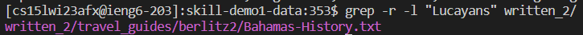

# Welcome to Bash Command `Grep` Tutorial!

In today's tutorial, we will cover a very important command in bash - `grep` - as well as several of its command-oline options. First of all, what is `grep`? 

`Grep` is a utility that searches information from the command line and outputs the result. There are several common and useful command line options, and today we'll talk about `-i`, `-r`, `-l`, and `-n`. 

## 0. Setup 

The database that we will be utilizing in today's tutorial is a github repository you can find [here](https://github.com/ucsd-cse15l-w23/skill-demo1-data). To clone it onto your machine, you can type `git clone https://github.com/ucsd-cse15l-w23/skill-demo1-data` into your bash command line. The rest of the tutorial will assume that you already have this "written_2" directory open. 

## 1. `-i`

The `-i` option tells grep to ignore uppercase vs. lowercase characters. If you cd into `written_2/travel_guides/berlitz1/` and type ls, you can see a bunch of text tiles of various different cities and countries around the world. If, say, we want to search the occurrences of the word "city" in the file "HistoryDublin.txt", we can type `grep "city" HistoryDublin.txt` or `grep "City" HistoryDublin.txt` into the command line. Here are their respective results: 

These commands of course work and are pretty useful, but just in case you want to include both the search results of "city" AND "City" in one search, you can instead type `grep -i "city" HistoryDublin.txt`. This will yield the following result: 

Pretty cool, right! Well, this is only the start! 

## 2. `-r`

Another very useful command is `-r`, which recursively searches all subdirectories for the word you want. Let's say you're in the main directory, and you want to find all the occurrences of the word "Lucayans". If you just type `grep "Lucayans" written_2`, it is not going to work, and Bash will tell you that "grep: written_2/: Is a directory". 

To solve this problem, all you have to do is to add the `-r` option, and then you can laugh and enjoy your cup of coffee while reading all the search results! If you type `grep -r "Lucayans" written_2`, you should see the following result:

Let's try this with another word! If you type `grep -r "hot pot" written_2`, you should see this result: 

## 3. `l`

The command line option `l` lists all the results from grep by the file names. For example, if I only wanted to know which file contained the word "Lucayans" and had no intention in seeing its actual occurrences in text, I could add `-l`. If you type `grep -r -l "Lucayans" written_2`, you should see the following result: 

See? Because "Lucayans" only appeared in one file, Bash only printed one line - it saved SO MUCH space! In fact, `-l` is extremely useful when you're searching for a word that occurs many many times. For instance, if you type `grep -r -l "Beijing" written_2`, you should see the following result: 

This much occurrences of the word "Beijing" would take up essentially my entire terminal, so it would be very hard then to find work I did above again. 

## 4. `-n`

Last but not least, we have the command line option `-n`. This adds a line number to each matching line, so that it is easier to find the words later on if you want. Take the word "Lucayans" again as an example. If you type `grep -r -n "Lucayans" written_2`, you should see the following result: 

See the "6" and "7" in front of each occurrence? We can also try it on the phrase "hot sauce." If you type `grep -r -n "hot sauce" written_2`, you should see the following result: 

This way, grep can not only tell us in which directory, file the word is in, but also its specific line number. How convenient! 

Every party comes to an end, and sadly this marks the end of our tutorial today. The sources I used in making this tutorial can be found [here](https://en.wikibooks.org/wiki/Grep). Please stay tuned for further releases in the future! 
