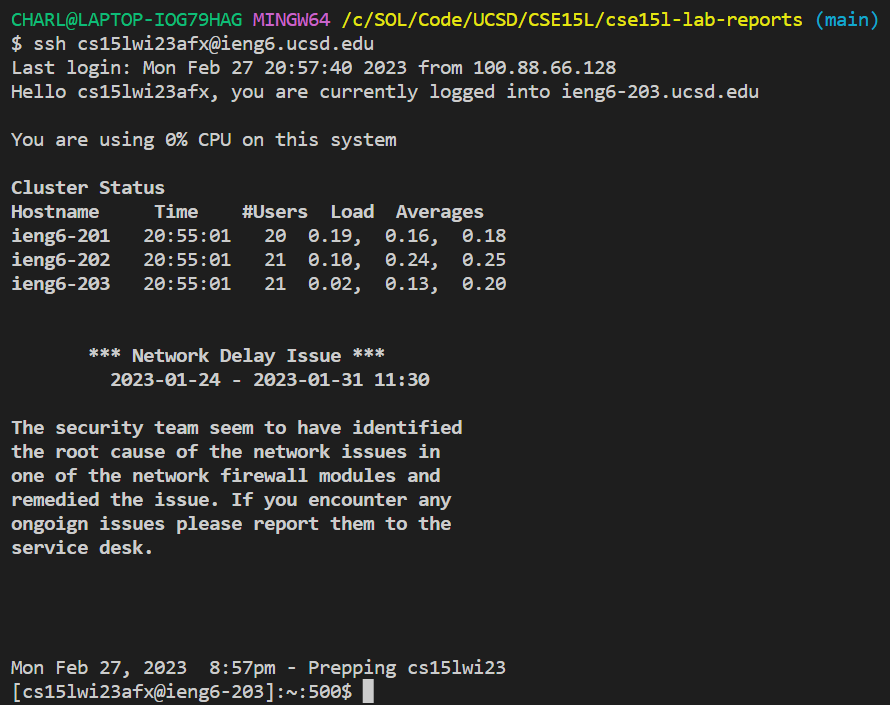
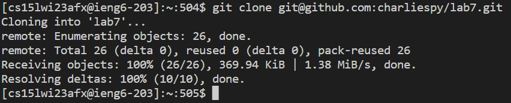
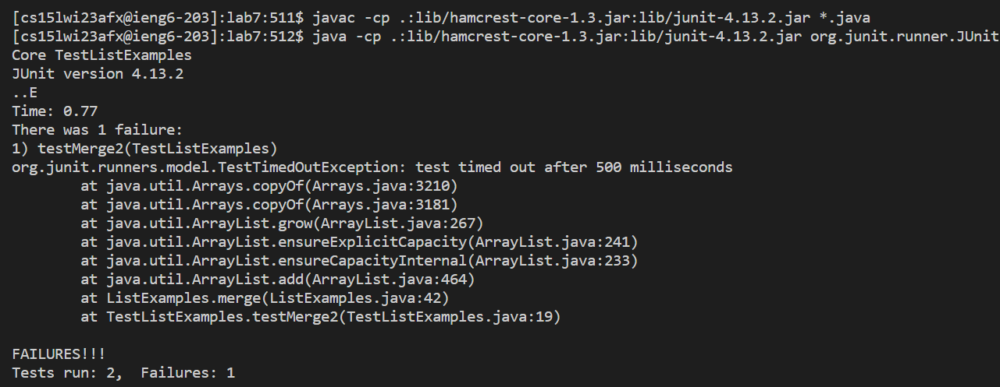
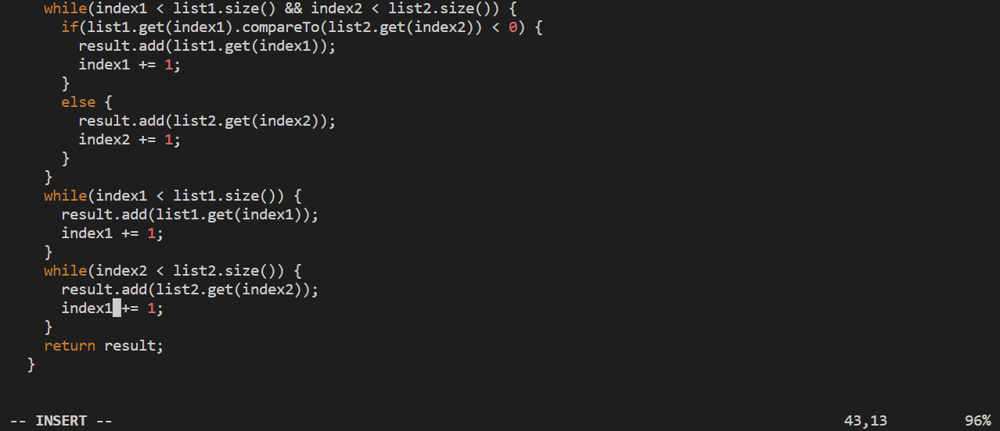
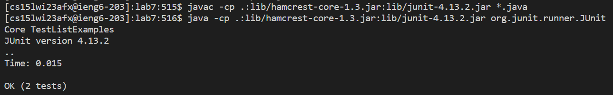

# Welcome to CSE15L "Quick Done" Challenge Tutorial! 

In today's tutorial, I'm going to talk about how I won the group stage competition of the CSE15L "Quick Done" challenge. Although my time was still slower than the final winner's time in our session, thirty-eight seconds, my PR of one minute and six seconds still managed to help me win the group stage. Let's first take a look of what the tasks are: 

1. **Setup** Delete any existing forks of the repository you have on your account
2. **Setup** Fork the repository
3. **The real deal** Start the timer!
4. Log into ieng6
5. Clone your fork of the repository from your Github account
6. Run the tests, demonstrating that they fail
7. Edit the code file to fix the failing test
8. Run the tests, demonstrating that they now succeed
9. Commit and push the resulting change to your Github account
*content cited from https://ucsd-cse15l-w23.github.io/week/week7/#week7-lab-report*

Now, let's talk about how to achieve each step! 

## Steps 1-3
Now, assuming that this is your first time doing the challenge, you wouldn't need to worry about step 1, as it is needed only if you want to repeat the challenge. But in case you *are* that ultimate tech geek, you can delete your previous results and start again by typing `cd`, and then `rm -rf lab7` in the terminal. 

For step 2, you should go to [this link](https://github.com/ucsd-cse15l-w23/lab7) and click the "Fork" button on the upper right corner. This will create your own version of the repository. 

For step 3, yeah you know what to do for this one... But anyway, the challenge is on! 

## Step 4
Now that you've started the timer, you should log into your ieng6 account. Simply type `ssh cs15lwi23abc@ieng6.ucsd.edu`, but make sure to replace "abc" with your own account number. Now, if you've attended the lab last week, you should be able to log in without password, which will be especially helpful to speed up the time. If you see this page, you should be good: 

## Step 5
To clone the the repository you just forker, type `git clone git@github.com:charliespy/lab7.git` in the terminal. However, you should replace "charliespy" with your own GitHub username. If you see something like this, you're on the right track: 

## Step 6
Next, we should enter the directory we just cloned from GitHub by typing `cd lab7`. To run the JUnit tests, we need to first run `javac -cp .:lib/hamcrest-core-1.3.jar:lib/junit-4.13.2.jar *.java` to compile the program, and then type `java -cp .:lib/hamcrest-core-1.3.jar:lib/junit-4.13.2.jar org.junit.runner.JUnitCore TestListExamples` to run the code. You should see something like this: 

## Step 7
Obviously, this there's something wrong with this program, so we must fix it. What I did was type `vim TestExamples.java` in the terminal. Inside the vim tool, I first pressed `i` to let it know I want to insert (or change) some content of this file. Then, I navigated to the fourth-til-last row, which is where my cursor is at in this picture: 

The issue with this program is that the "index1" at the cursor should be "index2", so after I navigated to this place by pressing `<down>` 43 times and pressing `<right>` 12 times, I then pressed `<delete>` one time and `2` once. Next, to exit vim, I pressed `<ESC>` once to exit insert mode and typed `:x` to return to the terminal. 

## Step 8 
Next, to run the tests, again, we just need to repeat what we did in Step 6 again. To run the JUnit tests, we need to first run `javac -cp .:lib/hamcrest-core-1.3.jar:lib/junit-4.13.2.jar *.java` to compile the program, and then type `java -cp .:lib/hamcrest-core-1.3.jar:lib/junit-4.13.2.jar org.junit.runner.JUnitCore TestListExamples` to run the code. But this time, you should see something like this: 

## Step 9
Last but not least, to push the code to our GitHub repository, we should first type `git add ListExamples.java` to tell git this is thing we care about. Next, type `git commit -m "your_message"` to commit the code to git. Lastly, type `git push` to push the changes to origin. Your result should look somewhat similar to this: 

Every party comes to an end, and sadly this marks the end of our tutorial today. Please stay tuned for further releases in the future! 