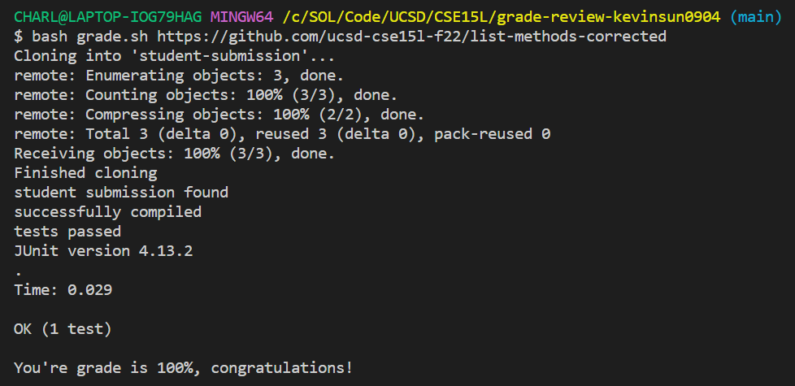

# Welcome to Bash Grading Script Tutorial! 
Hi! In today's tutorial, we will go over how to create your own grading script using Bash and Junit! The full script is posted at the end, so feel free to jump there if you want, but we're going to start by breaking it down bit by bit. 


## 1. Importing and Cloning the Repository
The code for this section is the following: 
```bash
CPATH='".;../lib/hamcrest-core-1.3.jar;../lib/junit-4.13.2.jar"'
rm -rf student-submission
git clone $1 student-submission
echo 'Finished cloning'
```

The first line that starts with "CPATH" is where we import the Junit library necessary to run the grader. 

The second line, `rm -rf student-submission`, is removing the current student-submission directory so we can start fresh. This step is important so that other students' work don't interfere with the student we're currently grading. 

The third line, `git clone $1 student-submission`, means that we are cloning the url at the first command-line argument (`$1`) and naming the resulting repository as `student-submission`. Note that we are assuming that the first command-line argument is a valid GitHub url, because otherwise, the `git clone` command will fail and exit the script. 

The last line is a status update, printing a messsage to the terminal that we've finished cloning. 


## 2. Locating the student submission
The code for this section is the following: 
```bash
cd student-submission

if [[ -f ListExamples.java ]]
then
  echo "student submission found"
else
  echo "wrong file submitted"
  echo "You're grade is 0%, try again!"
  exit 1
fi
```

In this section, we are going to first `cd` to the student-submission directory, then try to find a file called `ListExamples.java`.

We will next use an if-statement. If we have found that `ListExamples.java` is a valid filepath, then we will print to the terminal that this step is completed. 

However, if we do not find `ListExamples.java`, then we will print to the terminal, notifing the student that they ahve submitted the wrong file, and their grade is 0%. Then, by using `exit 1`, we will exit the program so the rest of the script will *not* be executed. 


## 3. Compiling the Submission
The code for this section is the following: 
```bash
cp ../TestListExamples.java ./
javac -cp ".;../lib/hamcrest-core-1.3.jar;../lib/junit-4.13.2.jar" *.java 2>compiler-error.txt

if [[ $? == 0 ]]
then
  echo "successfully compiled"
else
  echo "compiler error!!!"
  cat compiler-error.txt
  echo "You're grade is 0%, try again!"
  exit 1
fi
```

In the first line, by saying `cp ../TestListExamples.java ./`, we are copying the student code file and our test files in the same directory. 

Then, by saying `javac -cp ".;../lib/hamcrest-core-1.3.jar;../lib/junit-4.13.2.jar" *.java`, we are compiling the test file. 

In the same line right after this, by saying `2 > compiler-error.txt`, we are using a technique called "I/O redirection" to store any potential compile errors into a file called `compiler-error.txt`. The number 2 here is a file descriptor representing `stderr`. This allows us to stop the error, which would stop the file directly, and print our own corresponding messages. 

Then, we are going to use an if-statement to print corresponding messages if there is or isn't an error during the compiling process. 


## 4. Running the Tests and Reporting the Grade
After we've compiled the code, we will now run the tester! The code for this section is the following:
```bash
java -cp ".;../lib/hamcrest-core-1.3.jar;../lib/junit-4.13.2.jar" org.junit.runner.JUnitCore TestListExamples > results.txt 2>&1

if [[ $? == 0 ]]
then
  echo "tests passed"
  cat results.txt
  echo "You're grade is 100%, congratulations!"

else
  echo "tests failed"
  cat results.txt

  num_tests=$(grep 'Tests run: ' results.txt | cut -d' ' -f3 | grep -Eo '[0-9]{1,4}')
  failures=$(grep 'Failures: ' results.txt | cut -d' ' -f6 | grep -Eo '[0-9]{1,4}')
  successes=$(($num_tests-$failures))
  grade=$((($successes * 100) / ($num_tests)))

  echo "You're grade is" $grade"%. Try again!"
  exit 1
fi
```

In the first line, we are using Junit to test the student implementations. At the end of the line, by typing `>results.txt 2>&1`, we are storing the output (successfull or error) to a file called `results.txt`. 

Then, we are using an if-statement to say that if there's no error, it means that all the tests have passed. In this case, we will print the result and say that the student has received a grade of 100% (yay!).

However, if there is an error (meaning that one or more tests have failed), then we will first print the error message results, then calculate the grade for the student. 

We will use the commands `num_tests=$(grep 'Tests run:' results.txt | sed 's/^.*: //')` and `failures=$(grep 'Failures:' results.txt | sed 's/^.*: //')` to extract the information we need to calculate students' grade. This `grep` command will return the test numbers in `results.txt`. 

Then, we will convert `num_tests` and `failures` from strings to integers and calculate the percentage of tests that the student got correctly. 

At this point, our grading script is complete. A full version of the code is shown below: 
```bash
CPATH='".;../lib/hamcrest-core-1.3.jar;../lib/junit-4.13.2.jar"'
rm -rf student-submission
git clone $1 student-submission
echo 'Finished cloning'

cd student-submission

if [[ -f ListExamples.java ]]
then
  echo "student submission found"
else
  echo "wrong file submitted"
  echo "You're grade is 0%, try again!"
  exit 1
fi

cp ../TestListExamples.java ./
javac -cp ".;../lib/hamcrest-core-1.3.jar;../lib/junit-4.13.2.jar" *.java 2>compiler-error.txt

if [[ $? == 0 ]]
then
  echo "successfully compiled"
else
  echo "compiler error!!!"
  cat compiler-error.txt
  echo "You're grade is 0%, try again!"
  exit 1
fi

java -cp ".;../lib/hamcrest-core-1.3.jar;../lib/junit-4.13.2.jar" org.junit.runner.JUnitCore TestListExamples > results.txt 2>&1

if [[ $? == 0 ]]
then
  echo "tests passed"
  cat results.txt
  echo "You're grade is 100%, congratulations!"

else
  echo "tests failed"
  cat results.txt

  num_tests=$(grep 'Tests run: ' results.txt | cut -d' ' -f3 | grep -Eo '[0-9]{1,4}')
  failures=$(grep 'Failures: ' results.txt | cut -d' ' -f6 | grep -Eo '[0-9]{1,4}')
  successes=$(($num_tests-$failures))
  grade=$((($successes * 100) / ($num_tests)))

  echo "You're grade is" $grade"%. Try again!"
  exit 1
fi
```

In the next section, we will run our script with a few submission repositories to show you how it works. 

## 5. Examining our Grading Script
We will use four example repositories to test our grading script in this section. 

The first repository is https://github.com/ucsd-cse15l-f22/list-methods-lab3, and it contains an incorrect implementation. 


As you could see, our grading script does indeed mark this submission with a 0% and printed out the corresponding error message. 

The second repository we will use to test is https://github.com/ucsd-cse15l-f22/list-methods-corrected, which contains a correct implementation. 



As expected, this submission got a 100%, nice job! 

The third example we will use is a https://github.com/ucsd-cse15l-f22/list-methods-compile-error, which has a syntax error. 


The grading script gave this student a 0% as well and pointed out that it was due to a compiler error. This gives the student a clue as to where they should fix their code. 

Lastly, we added two tests in our tester that will always pass no matter what, and now let's check the score calculation part of our grading script with the first repository above.


As you could see, the grade shows up as 66%, which is exactly what we predicted, so we can confirm that the grade calculation part is also correct. 

This marks the end of the tutorial. Good luck in your future studies! 