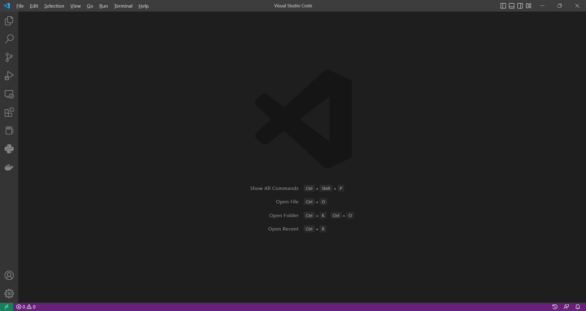
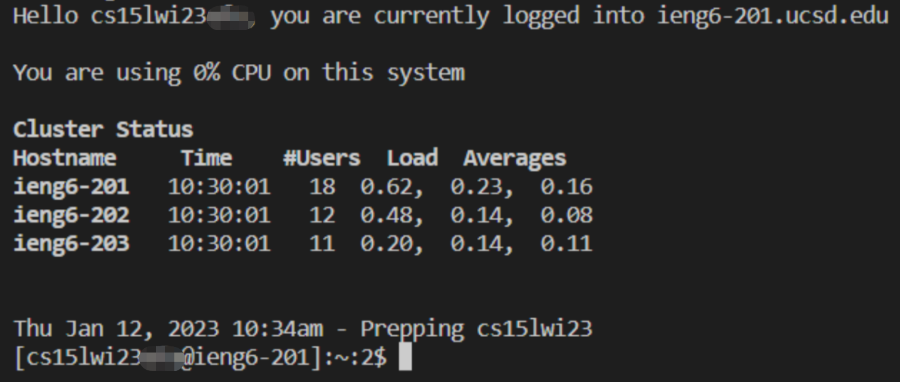
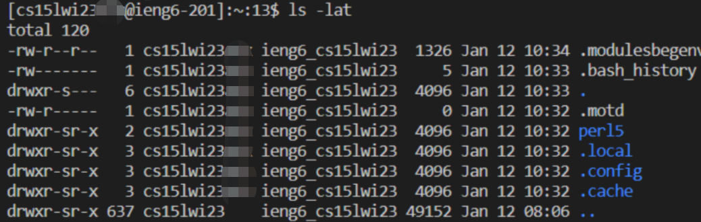

# Welcome to ieng6 Remote Server Tutorial!

This is the first of a magnum opus series, *CSE 15L Lab Reports*, written by our own UCSD student Charlie Sun. In this tutorial, he is going to lead you through the three steps of logging into a course-specific account on __ieng6__. 

## 1 - Installing VScode
VScode is a popular programming text editor all around the world. To start off, go to [this link](code.visualstudio.com) (code.visualstudio.com), and follow the instructions to donwload and install the application on your machine. Be care of of the version you download (Windows vs. Mac vs. Linux)!

When it is installed, you be able to open it and see something like this: 

## 2 - Remotely Connecting

## 3 - Trying Some Commands

