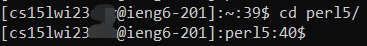
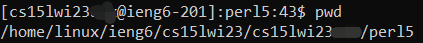
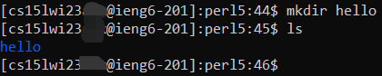

# Welcome to ieng6 Remote Server Tutorial!

This is the first of a magnum opus series, *CSE 15L Lab Reports*, written by our own UCSD student Charlie Sun. In this tutorial, he is going to lead you through the three steps of logging into a course-specific account on __ieng6__. 

## 1 - Installing VScode
VScode is a popular programming text editor all around the world. To start off, go to [this link](code.visualstudio.com), and follow the instructions to donwload and install the application on your machine. Be care of of the version you download (Windows vs. Mac vs. Linux)!

When it is installed, you should be able to open it and see something like this: 


Yay! You have completed the first step!


## 2 - Remotely Connecting
Another thing we must install, if you're on Windos, is git bash. Go to [this link](https://gitforwindows.org/) and install git bash on your computer. Once installed, follow the instructions on [this article](https://stackoverflow.com/questions/42606837/how-do-i-use-bash-on-windows-from-the-visual-studio-code-integrated-terminal/50527994#50527994) to set your default terminal on VScode as git bash. 

Next, to access `ssh`, open a new terminal on VScode and type the following command, but with the zz replaced by your own account characters. 
```
ssh cs15lwi23zz@ieng6.ucsd.edu
```

Since this is your first time connecting to the server (otherwise why would you be reading this tutorial), you'll see a message like this: 
```
⤇ ssh cs15lwi23zz@ieng6.ucsd.edu
The authenticity of host 'ieng6.ucsd.edu (128.54.70.227)' can't be established.
RSA key fingerprint is SHA256:ksruYwhnYH+sySHnHAtLUHngrPEyZTDl/1x99wUQcec.
Are you sure you want to continue connecting (yes/no/[fingerprint])? 
```

Just go ahead and type "yes" in the terminal, and enter your password when prompted to. 
> Note: When you type your password, what you've entered will NOT appear on the screen. Don't panic, just type them in all at once. 

If you've entered your password correctly, you'll see a message like this: 


Congratulations! Your terminal is now connected to a computer in the CSE basement! 


## 3 - Trying Some Commands
Once you're connected to the server, you may try some commands, such as `cd`, `ls`, `pwd`, `mkdir`, and `ls -lat`. Try running them both on your *local* computer and on the *remote* server. How are they different? 

For example, when you type `ls -lat` in the terminal, you'll likely see something like this: 


The `ls` command shows all the files/subdirectories in the current directory. Adding the ` -lat` flag behind `ls` in addition shows all the hidden files, sorted based on last time modified (most recent on top). 

\

If you type `ls`, you'll see that one of the subdirectories is "perl5". If we type `cd perl5` in the terminal, we can jump to that directory! 



\

Inside of the `perl5` directory, if you type `pwd`, which stands for "print working directory," in the terminal, it will show us this: 



\

Now, if we want to make a new directory in `perl5` called "hello", we can type the following command: 



As you can see, after we typed `mkdir hello` in the terminal, nothing happened, but if we type `ls` again now, we can see that there's a new directory called "hello" now! 

\

After you've had enough fun with ieng6, to log out of the remote server, simply press Ctrl-D or type `exit` in the terminal. 

**This marks the end of this tutorial. Stay tuned for more tutorials about Computer Science in the future! Peace!**

